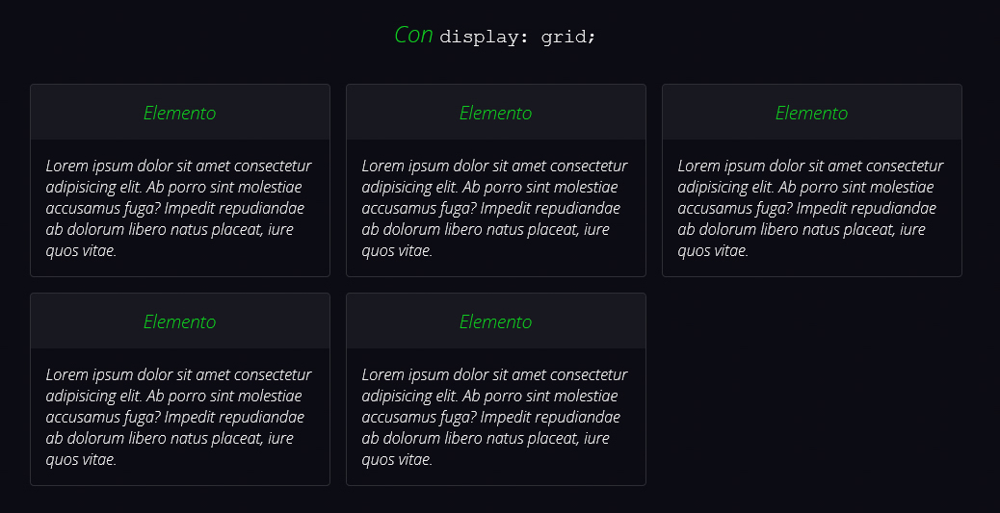
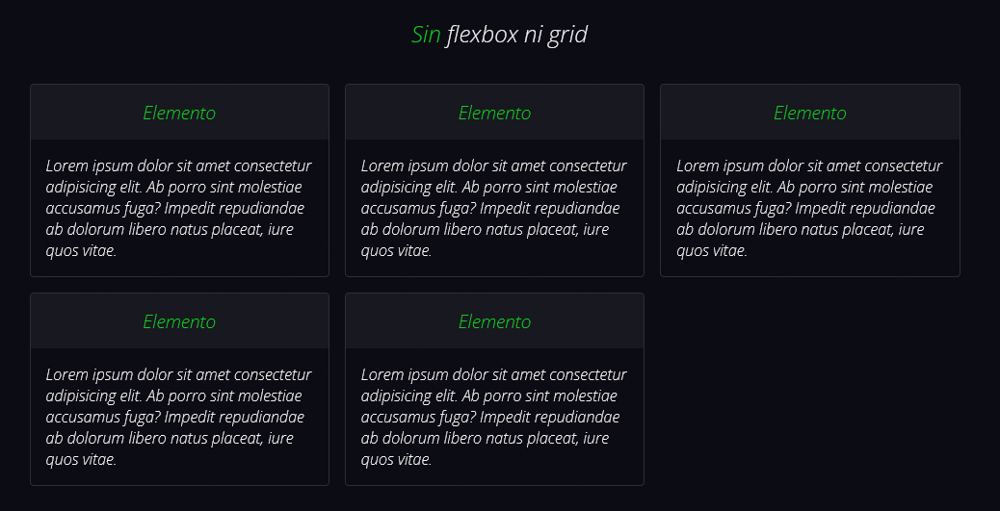

# Sistema de columnas sin flexbox ni grid

## Con `display: grid;`

```html
<article class="article display-grid">
    <h2 class="display-grid--full-width">
        Con display: grid;
    </h2>
    <section>
        <h3>Elemento</h3>
        <p>Lorem ipsum dolor sit amet consectetur adipisicing elit.
           Ab porro sint molestiae accusamus fuga? Impedit repudiandae
           ab dolorum libero natus placeat, iure quos vitae.</p>
    </section>
    <section>
        <h3>Elemento</h3>
        <p>Lorem ipsum dolor sit amet consectetur adipisicing elit.
           Ab porro sint molestiae accusamus fuga? Impedit repudiandae
           ab dolorum libero natus placeat, iure quos vitae.</p>
    </section>
    <section>
        <h3>Elemento</h3>
        <p>Lorem ipsum dolor sit amet consectetur adipisicing elit.
           Ab porro sint molestiae accusamus fuga? Impedit repudiandae
           ab dolorum libero natus placeat, iure quos vitae.</p>
    </section>
    <section>
        <h3>Elemento</h3>
        <p>Lorem ipsum dolor sit amet consectetur adipisicing elit.
           Ab porro sint molestiae accusamus fuga? Impedit repudiandae
           ab dolorum libero natus placeat, iure quos vitae.</p>
    </section>
    <section>
        <h3>Elemento</h3>
        <p>Lorem ipsum dolor sit amet consectetur adipisicing elit.
           Ab porro sint molestiae accusamus fuga? Impedit repudiandae
           ab dolorum libero natus placeat, iure quos vitae.</p>
    </section>
</article>
```

```css
.display-grid {
    display: grid;
    grid-template-columns: repeat(auto-fit, minmax(300px, 1fr));
    grid-gap: 1rem;
}

/* Para que el título ocupe todo el ancho disponible */
.display-grid--full-width {
    grid-column: 1 / -1;
}
```



## Con `display: flex;`

```html
<article class="display-flex">
    <h2 class="display-flex__full-width">
        Con display: flex;
    </h2>
    <section class="display-flex__column">
        <h3>Elemento</h3>
        <p>Lorem ipsum dolor sit amet consectetur adipisicing elit.
           Ab porro sint molestiae accusamus fuga? Impedit repudiandae
           ab dolorum libero natus placeat, iure quos vitae.</p>
    </section>
    <section class="display-flex__column">
        <h3>Elemento</h3>
        <p>Lorem ipsum dolor sit amet consectetur adipisicing elit.
           Ab porro sint molestiae accusamus fuga? Impedit repudiandae
           ab dolorum libero natus placeat, iure quos vitae.</p>
    </section>
    <section class="display-flex__column">
        <h3>Elemento</h3>
        <p>Lorem ipsum dolor sit amet consectetur adipisicing elit.
           Ab porro sint molestiae accusamus fuga? Impedit repudiandae
           ab dolorum libero natus placeat, iure quos vitae.</p>
    </section>
    <section class="display-flex__column">
        <h3>Elemento</h3>
        <p>Lorem ipsum dolor sit amet consectetur adipisicing elit.
           Ab porro sint molestiae accusamus fuga? Impedit repudiandae
           ab dolorum libero natus placeat, iure quos vitae.</p>
    </section>
    <section class="display-flex__column">
        <h3>Elemento</h3>
        <p>Lorem ipsum dolor sit amet consectetur adipisicing elit.
           Ab porro sint molestiae accusamus fuga? Impedit repudiandae
           ab dolorum libero natus placeat, iure quos vitae.</p>
    </section>
</article>
```

```css
.display-flex {
    display: flex;
    flex-wrap: wrap;
    align-items: center;
    gap: 1rem;
}

/* Para que el título ocupe todo el ancho disponible */
.display-flex__full-width {
    width: 100%;
}

/* 
 Se descuenta al ancho la mitad de lo que mide la propiedad "gap" 
 en el padre del elemento para que sean dos columnas (en el caso 1 y 3 columnas en el caso 2)
*/

/* 1 */
@media screen and (min-width: 648px) {
    .display-flex__column {
        width: calc(50% - .5rem);
    }
}
/* 2 */
@media screen and (min-width: 964px) {
    .display-flex__column {
        width: calc(33% - .5rem);
    }
}
```


## Sin flexbox ni grid

```html
<article class="without-flex-grid">
    <h2 class="without-flex-grid--full-width">
        Sin flexbox ni grid
    </h2>
    <section class="without-flex-grid__column">
        <h3>Elemento</h3>
        <p>Lorem ipsum dolor sit amet consectetur adipisicing elit.
           Ab porro sint molestiae accusamus fuga? Impedit repudiandae
           ab dolorum libero natus placeat, iure quos vitae.</p>
    </section>
    <section class="without-flex-grid__column">
        <h3>Elemento</h3>
        <p>Lorem ipsum dolor sit amet consectetur adipisicing elit.
           Ab porro sint molestiae accusamus fuga? Impedit repudiandae
           ab dolorum libero natus placeat, iure quos vitae.</p>
    </section>
    <section class="without-flex-grid__column">
        <h3>Elemento</h3>
        <p>Lorem ipsum dolor sit amet consectetur adipisicing elit.
           Ab porro sint molestiae accusamus fuga? Impedit repudiandae
           ab dolorum libero natus placeat, iure quos vitae.</p>
    </section>
    <section class="without-flex-grid__column">
        <h3>Elemento</h3>
        <p>Lorem ipsum dolor sit amet consectetur adipisicing elit.
           Ab porro sint molestiae accusamus fuga? Impedit repudiandae
           ab dolorum libero natus placeat, iure quos vitae.</p>
    </section>
    <section class="without-flex-grid__column">
        <h3>Elemento</h3>
        <p>Lorem ipsum dolor sit amet consectetur adipisicing elit.
           Ab porro sint molestiae accusamus fuga? Impedit repudiandae
           ab dolorum libero natus placeat, iure quos vitae.</p>
    </section>
</article>
```

```css
.without-flex-grid {
    padding-left: .5rem;
    padding-right: .5rem;
    font-size: 0;  /* Quita el espaciado que añade la propiedad "inline" a los elementos */
}

.without-flex-grid--full-width {
    width: 100%;
    font-size: 1.5rem; /* Se redeclara el "font-size" porque se hereda 0 desde el padre */
    padding-top: 1rem;
    padding-bottom: 1rem;
}

.without-flex-grid__column {
    font-size: initial; /* Se redeclara el "font-size" porque se hereda 0 desde el padre */
    display: inline-block;
    margin-right: .5rem;
    margin-left: .5rem;
    margin-bottom: 1rem;
}

/* 
 Se descuenta lo que mide de margin para que no desborde 
 y el elemento salte a la siguiente línea
*/
@media screen and (min-width: 630px) {
    .without-flex-grid__column {
        width: calc(50% - 1rem);
    }
}

@media screen and (min-width: 947px) {
    .without-flex-grid {
        padding-right: 0;
    }

    .without-flex-grid__column {
        width: calc(33% - 1rem);
    }
}
```


